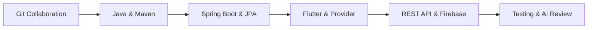
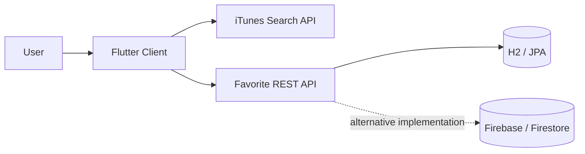

<div align="center">

<h1>Practical Coding 1</h1>

<h3>Git부터 Flutter·Spring Boot·Firebase·테스트까지 이어지는 Full-Stack Learning Journey</h3>

<p>
  
  
  
  
  
  
</p>

<p>
  자습으로 익힌 기술과 프로젝트를<br>
  <strong>기초 도구 → 백엔드 → 프론트엔드 → 풀스택 → 테스트와 개선</strong>의 학습 흐름으로 재구성한 모노레포입니다.
</p>

</div>

---

## 30초 요약

| 구분 | 내용 |
| --- | --- |
| 학습 목표 | 프론트엔드와 백엔드가 API를 통해 연결되고 데이터가 저장되는 전체 흐름 이해 |
| 핵심 역량 | Git 협업, Java/Maven, Spring Boot, REST API, JPA, Flutter, Node.js, Firebase, 테스트 |
| 대표 결과물 | 음악 검색·즐겨찾기 풀스택 앱, Markdown Viewer, AI-assisted Todo CLI |
| 저장소 구성 | 완성도 높은 결과물은 `projects`, 개념별 실습은 `labs`에 배치 |
| 검증 | Spring 테스트 3개 모듈 통과, Python 테스트 9개 통과, Flutter 프로젝트 3개 분석·테스트 통과 |

> 이 저장소의 핵심은 프레임워크 이름을 나열하는 것이 아니라,<br>
> **각 기술이 애플리케이션의 어느 문제를 해결하는지 직접 구현하며 이해한 과정**입니다.

## Learning Path



| 단계 | 배운 내용 | 확인할 수 있는 코드 |
| --- | --- | --- |
| 1. 협업과 버전 관리 | commit, branch, merge, fork, merge request | [`labs/git-collaboration`](labs/git-collaboration) |
| 2. Java 빌드와 테스트 | Maven 표준 구조, dependency, JUnit | [`labs/java-maven`](labs/java-maven) |
| 3. 백엔드 기초 | REST Controller, JPA, Repository, MySQL/H2 | [`labs/spring-boot-basics`](labs/spring-boot-basics) |
| 4. Flutter UI | Widget, navigation, Provider, responsive layout | [`labs/flutter-namer`](labs/flutter-namer), [`labs/flutter-navigation`](labs/flutter-navigation) |
| 5. 풀스택 연결 | HTTP 통신, 외부 API, 즐겨찾기 CRUD, Firebase | [`projects/favorite-music`](projects/favorite-music) |
| 6. 품질 개선 | 테스트 시나리오, 예외 처리, AI 코드 리뷰 | [`projects/ai-todo-cli`](projects/ai-todo-cli) |

## Featured Projects

### 1. Favorite Music — Full-Stack Application

아티스트를 검색해 앨범을 조회하고, 좋아하는 앨범을 저장·삭제하는 애플리케이션입니다.



| 영역 | 구현 내용 |
| --- | --- |
| Flutter client | Provider 기반 상태 관리, 검색·즐겨찾기 화면, 비동기 HTTP 요청 |
| Spring API | Controller-Service-Repository 계층, JPA Entity, H2 저장소, CRUD API |
| Node/Firebase API | Express route, Firebase Admin SDK, Firestore 연동 |
| 외부 서비스 | iTunes Search API 앨범 검색 |

**이 프로젝트에서 배운 점**

- 화면 상태와 서버 데이터를 동기화하는 방법
- 프론트엔드가 REST API의 상태 코드와 실패 상황을 처리하는 방법
- 동일한 요구사항을 Spring/JPA와 Node/Firebase로 구현했을 때의 구조적 차이
- API 주소와 비밀 키를 코드에 직접 넣지 않고 실행 환경에서 분리하는 방법

[`Favorite Music 자세히 보기`](projects/favorite-music)

### 2. Spring Markdown Viewer

classpath의 Markdown 파일을 읽고 CommonMark로 HTML을 생성한 뒤 Thymeleaf 화면에 렌더링합니다.

- Spring MVC의 요청·응답 흐름
- 동적 path parameter 처리
- 서버 내부 리소스 읽기
- Markdown parsing 결과를 View에 전달하는 과정

[`Spring Markdown Viewer 자세히 보기`](projects/spring-markdown-viewer)

### 3. AI-assisted Todo CLI

할 일을 JSON 파일에 저장하는 Python 콘솔 프로그램입니다. 기능 구현 이후 테스트 시나리오를 작성하고 AI 기반 코드 리뷰·리팩터링 과정을 실습했습니다.

- 할 일 추가·조회·완료·삭제
- 상·중·하 우선순위 정렬
- JSON 저장과 이전 데이터 복구
- 정상·실패·경계값 테스트
- 잘못된 입력과 파일 오류 예외 처리

[`AI-assisted Todo CLI 자세히 보기`](projects/ai-todo-cli)

## Tech Stack

| Category | Technologies |
| --- | --- |
| Frontend | Flutter, Dart, Material UI, Provider |
| Backend | Java 17, Spring Boot, Spring MVC, Node.js, Express |
| Data | Spring Data JPA, H2, MySQL, Firebase Firestore, JSON |
| API | REST, iTunes Search API, Firebase Admin SDK |
| Testing | JUnit, Spring Boot Test, pytest, Flutter Test |
| Tools | Git, GitLab, GitHub, Maven, Docker, Docker Compose |

## Verification

공개용으로 정리하면서 개인정보와 로컬 설정을 분리하고, 아래 항목을 직접 검증했습니다.

- ✅ Favorite Music Spring API — `mvn test`
- ✅ Spring Markdown Viewer — `mvn test`
- ✅ Spring Boot Basics — `mvn test`
- ✅ AI-assisted Todo CLI — `9 passed`
- ✅ Flutter 3개 프로젝트 — `flutter analyze` 통과
- ✅ Flutter 3개 프로젝트 — widget test 통과
- ✅ 학번, 학교 이메일, DB 비밀번호, Firebase key 비공개 처리

## Repository Structure

```text
.
├── docs/
│   └── course-map.md              # 원본 과제와 통합 구조 매핑
├── labs/
│   ├── git-collaboration/         # Git 협업 흐름
│   ├── java-maven/                # Maven과 JUnit
│   ├── spring-boot-basics/        # REST, JPA, MySQL/H2
│   ├── flutter-namer/             # Provider와 반응형 UI
│   └── flutter-navigation/        # 화면 이동과 상태
└── projects/
    ├── favorite-music/
    │   ├── flutter-client/
    │   ├── spring-api/
    │   └── node-firebase-api/
    ├── spring-markdown-viewer/
    └── ai-todo-cli/
```

학교 GitLab에 나뉘어 있던 원본 저장소와 현재 폴더의 대응 관계는 [`docs/course-map.md`](docs/course-map.md)에서 확인할 수 있습니다.

## Key Takeaways

1. **프론트엔드와 백엔드는 API 계약으로 연결된다.**<br>
   화면 구현만이 아니라 요청 형식, 응답 데이터, HTTP 상태와 오류 처리까지 함께 고려했습니다.

2. **데이터 저장 방식이 달라도 애플리케이션 요구사항은 동일하게 유지될 수 있다.**<br>
   JPA/H2와 Firebase/Firestore 구현을 비교하며 계층 구조와 개발 방식의 차이를 경험했습니다.

3. **작동하는 코드와 검증된 코드는 다르다.**<br>
   JUnit, pytest, Flutter Test를 사용해 정상 흐름뿐 아니라 실패·경계 상황도 확인했습니다.

4. **AI는 결과를 대신 만드는 도구가 아니라 리뷰와 개선을 돕는 도구로 활용할 수 있다.**<br>
   요구사항 정의, 테스트 시나리오 작성, 코드 리뷰와 리팩터링 단계를 분리해 실습했습니다.

---

<div align="center">

<strong>From Git basics to a tested full-stack application.</strong>

</div>
